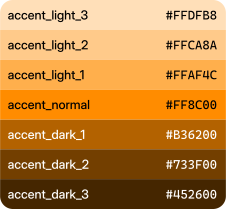

# Accent color and shades

Windows generates an accent palette based on the current accent color. It consists of 7 colors:

- 3 dark variants (-3, -2 and -1)
- the original accent color (A)
- 3 light variants (+1, +2 and +3)

{ .no-lightbox }

For the current accent color we'll use <font color="#0078D4">&nbsp;:fontawesome-solid-circle:</font> **#0078D4** (the default accent color). The output values shown bellow were generated on a Windows 11 machine.

For simplicity, you can get a specific accent color shade from one of the following variables:

| Variable | Example color output |
|:---------|:--------------------:|
| **accent_light** (or **accent_dark_mode**) | <div style="display: flex; align-items: center; justify-content: center;">{ .no-lightbox } &nbsp;&nbsp;#4CC2FF</div> |
| **accent_normal**                             | <div style="display: flex; align-items: center; justify-content: center;">{ .no-lightbox } &nbsp;&nbsp;#0078D4</div>  |
| **accent_dark** (or **accent_light_mode**) | <div style="display: flex; align-items: center; justify-content: center;">{ .no-lightbox } &nbsp;&nbsp;#0067C0</div>  |

Here's an example for printing them in the console:

```python
import winaccent

print(f"accent_light: {winaccent.accent_light}")  # winaccent.accent_dark_mode returns the same color
print(f"accent_normal: {winaccent.accent_normal}")
print(f"accent_dark: {winaccent.accent_dark}")  # winaccent.accent_light_mode returns the same color
```

If you need a different shade than the ones listed above, here's the complete list of variables:

| Variable | Example color output |
|:---------|:--------------------:|
| **accent_light_3** | <div style="display: flex; align-items: center; justify-content: center;">{ .no-lightbox } &nbsp;&nbsp;#99EBFF</div> |
| **accent_light_2** | <div style="display: flex; align-items: center; justify-content: center;">{ .no-lightbox } &nbsp;&nbsp;#4CC2FF</div> |
| **accent_light_1** | <div style="display: flex; align-items: center; justify-content: center;">{ .no-lightbox } &nbsp;&nbsp;#0091F8</div> |
| **accent_normal**  | <div style="display: flex; align-items: center; justify-content: center;">{ .no-lightbox } &nbsp;&nbsp;#0078D4</div>  |
| **accent_dark_1**  | <div style="display: flex; align-items: center; justify-content: center;">{ .no-lightbox } &nbsp;&nbsp;#0067C0</div>  |
| **accent_dark_2**  | <div style="display: flex; align-items: center; justify-content: center;">{ .no-lightbox } &nbsp;&nbsp;#003E92</div>  |
| **accent_dark_3**  | <div style="display: flex; align-items: center; justify-content: center;">{ .no-lightbox } &nbsp;&nbsp;#001A68</div>  |

```python
import winaccent

print(f"accent_light_3: {winaccent.accent_light_3}")
print(f"accent_light_2: {winaccent.accent_light_2}")
print(f"accent_light_1: {winaccent.accent_light_1}")
print(f"accent_normal: {winaccent.accent_normal}")
print(f"accent_dark_1: {winaccent.accent_dark_1}")
print(f"accent_dark_2: {winaccent.accent_dark_2}")
print(f"accent_dark_3: {winaccent.accent_dark_3}")
```

!!! note
    `accent_dark_mode`, `accent_light` and `accent_light_2` return the same color. `accent_light_mode`, `accent_dark` and `accent_dark_1` also return the same color. 

!!! note
    The accent palette generation algorithm is slightly different in Windows 11 from the one in Windows 10. Here's an example with the <font color="#FF8C00">&nbsp;:fontawesome-solid-circle:</font> **#FF8C00** (Gold) accent color on both Windows 10 and 11:

    <div align="center" style="display: flex; flex-wrap: wrap;">

    <figure markdown>
    
    <br>Windows 10
    </figure>

    <figure markdown>
    
    <br>Windows 11
    </figure>
    
    </div>

!!! note
    In Windows 8.x, 7 and Vista, there's no accent palette generation algorithm. For maintaining compatibility, winaccent will automatically generate a palette using a custom algorithm that tries to immitate the one from Windows 10. It's not perfect, but there's still room for improvement.

    Using the same accent color as in the example above with Windows 10 and 11 on Windows 8.1 will give this result (Windows 8.0 is limited to only a few predefined accent colors):

    <div align="center">

    <figure markdown>
    
    <br>Windows 8.1
    </figure>

    </div>

    You can also try it without installing anything [here](../playground/custom-accent-palette-generation-algorithm.md).

!!! warning
    The color variables will return the colors in HEX strings (e.g. `#RRGGBB`). If you need an RGB tuple instead of a HEX color string, use the `hex_to_rgb` function. See [HEX string color to RGB integer tuple function](../other-features/hex-to-rgb-function.md) for more information.

!!! note
    You can also force winaccent to use the accent color provided by DWM (`ColorizationColor` in Windows 8.x and `AccentColor` in Windows 10 and 11 in the registry) and generate the accent palette accordingly. To do that, you have to enable the `get_accent_from_dwm` flag. See [`get_accent_from_dwm` flag](../other-features/flags.md#get_accent_from_dwm-flag) for more information.

You may want to take a look at Microsoft's accent color guidelines. You can do that [here](https://learn.microsoft.com/en-us/windows/apps/design/style/color#accent-color-palette).