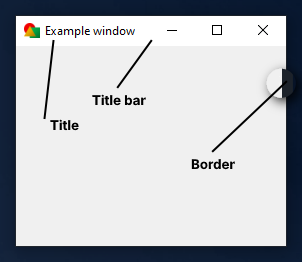
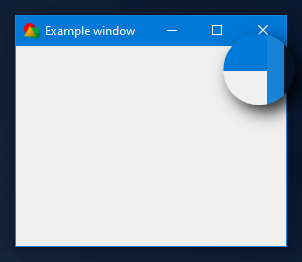
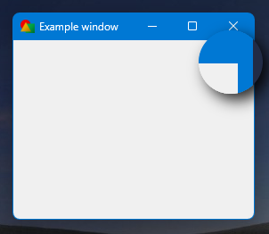
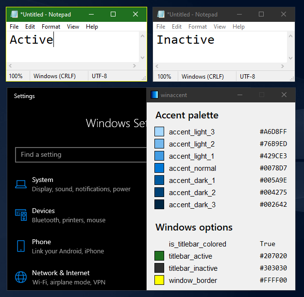

# Window chrome colors

The window chrome refers to the parts of a window that are drawn by the operating system rather than by the application itself. This typically includes the title bar, window borders and close/minimize/maximize buttons. These elements surround the main content area of the application and allow the user to move, resize, or control the window. Not to be confused with the Google Chrome web browser.

{ .rounded }

winaccent allows you to get some window chrome colors. You can do that using the following variables:

| Variable               | Description                              |
|:-----------------------|:-----------------------------------------|
| titlebar_active        | Returns the active title bar color        |
| titlebar_active_text   | Returns the active title bar text color   |
| titlebar_inactive      | Returns the inactive title bar color      |
| titlebar_inactive_text | Returns the inactive title bar text color |
| window_border_active   | Returns the active window border color   |
| window_border_inactive | Returns the inactive window border color |

Here's an example for retrieving the colors:

```python
import winaccent

print(f"Active title bar color: {winaccent.titlebar_active}")
print(f"Active title bar text color: {winaccent.titlebar_active_text}")
print(f"Inactive title bar color: {winaccent.titlebar_inactive}")
print(f"Inactive title bar text color: {winaccent.titlebar_inactive_text}")
print(f"Active window border: {winaccent.window_border_active}")
print(f"Inactive window border: {wintaccent.window_border_inactive}")
```

!!! note
    `titlebar_inactive` will return `None` if the inactive title bar color isn't set (it isn't set by default on Windows). This can be usually done in the registry by creating or modifying the `AccentColorInactive` DWORD 32-bit value from `HKEY_CURRENT_USER\Software\Microsoft\Windows\DWM`. The color must be in the following form: `FFBBGGRR` (like a normal RGB HEX color, but the red and the blue values are swapped with each other).

!!! note
    If you want to obtain the dark mode window chrome colors, you will have to enable the `dark_mode_titlebar` flag. See [`dark_mode_window` flag](../other-features/flags.md#dark_mode_window-flag) for more information.

!!! note
    For checking if windows have colored title bars and borders, you can use the `is_titlebar_colored` boolean variable. See [Colored title bars and window borders](../other-features/settings.md#colored-title-bars-and-window-borders) for more information.

!!! important
    The window border color is translucent (except when the "Show accent color on title bars and window borders" option from Settings > Personalization > Colors is enabled). winaccent will return the window border color without opacity to prevent some issues.

    Also, the window border color is actually slightly different than the title bar color on Windows 10 (only on Windows 11 it's the same).

    <div alignment="center" style="display: flex; flex-wrap: wrap;">

    <figure markdown>
    { .rounded }
    <br>Windows 10
    </figure>

    <figure markdown>
    { .rounded }
    <br>Windows 11
    </figure>

    </div>

    Title bar and window border colors can also be customized from the registry:

    <div align="center">
    { .rounded }
    </div>

!!! warning
    These variable might not return the right colors on systems that use custom themes or are heavily modified.