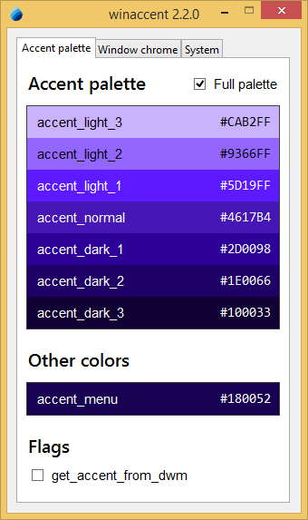
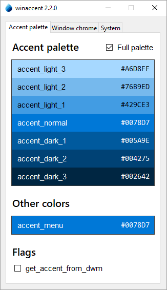
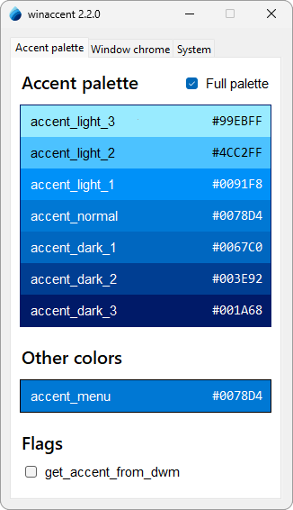

# Try the demo

Before using winaccent, you can try the demo program to see how it works and what features are implemented. The demo program can be launched in 3 different modes: console mode, GUI mode and auto mode.

!!! warning
    You must have winaccent installed to be able to run the demo program. See [Installation](installation.md) for more information about installing winaccent.


## The console mode
In the console mode, the demo program will display the current winaccent version and everything winaccent can get. To launch the demo program, type the following command in your terminal:

```
python -m winaccent --mode console
```

The output will look like this:

```
winaccent 2.1.0
===============

Accent palette
--------------

accent_light_3:                 #99EBFF
accent_light_2:                 #4CC2FF
accent_light_1:                 #0091F8
accent_normal:                  #0078D4
accent_dark_1:                  #0067C0
accent_dark_2:                  #003E92
accent_dark_3:                  #001A68


Window chrome
-------------

is_titlebar_colored:            False
titlebar_active:                #F3F3F3
titlebar_active_text:           #000000
titlebar_inactive:              #F3F3F3
titlebar_inactive_text:         #929292
window_border_active:           #757575
window_border_inactive:         #757575


Start Menu
----------

is_start_menu_colored:          False
start_menu:                     #242424


Taskbar
-------

is_taskbar_colored:             False
taskbar:                        #1C1C1C


UI Appearance
-------------

transparency_effects_enabled:   True
apps_use_light_theme:           False
system_uses_light_theme:        False


Other colors
------------

accent_menu:                    #0078D4
```


## The GUI mode
In the GUI mode, the demo program will display a window with an interactive user interface where you can better explore what winaccent has to offer. To run the demo program in the GUI mode, run the following command:

```
python -m winaccent --mode gui
```

The GUI demo looks like this:

<div markdown align="center" style="display: flex; flex-wrap: wrap;">

<figure markdown>

<br>Windows 8.x
</figure>

<figure markdown>

<br>Windows 10
</figure>

<figure markdown>

<br>Windows 11
</figure>

</div>

!!! warning
    The GUI mode will not work if Python isn't installed with tcl/tk support, because the GUI demo program is written in tkinter. If you installed Python on your computer without tcl/tk support, follow these steps to modify your installation to include the support:

    **Windows 11**:

    1. Open the Settings app.
    2. In the sidebar, click on "Apps".
    3. In the Apps section, go to "Installed apps"
    4. Using the search box, look for "Python" and find your Python installation (not the Launcher).
    5. Click the 3 dots next to your Python installation and choose "Modify".
    6. If the User Account Control window appears, click on "Yes".
    7. After the Python Setup window appeared, choose "Modify".
    8. In the Optional features section, make sure "tcl/tk and IDLE" option is checked and then click "Next".

    **Windows 10**:

    1. Open the Settings app.
    2. From the list of settings categories, choose "Apps"
    3. Using the search box, look for "Python" and find your Python installation (not the Launcher).
    4. Click on your Python installation, then choose "Modify".
    5. If the User Account Control window appears, click on "Yes".
    6. After the Python Setup window appeared, choose "Modify"
    7. In the Optional features section, make sure "tcl/tk and IDLE" option is checked and then click "Next".

    **Windows 8.x**

    1. Open Control Panel.
    2. Using the search box, look for "Programs and features" and when found click on it.
    3. In the list of the programs displayed, look for your Python installation (not the Launcher), right-click on it and then choose "Change".
    4. If the User Account Control window appears, click on "Yes"
    5. After the Python Setup window appeared, choose "Modify"
    6. In the Optional features section, make sure "tcl/tk and IDLE" option is checked and then click "Next".

    After installation of tcl/tk, the GUI demo program should be working.


## The auto mode
The auto mode will basically run the demo program in GUI mode if tcl/tk is available, installed correctly and no other error occurs or in console mode if tcl/tk is unavailable, not installed correctly or an error occured. To run the demo program in the auto mode, run the following command:

```
python -m winaccent --mode auto
```

... or even shorter:

```
python -m winaccent
```