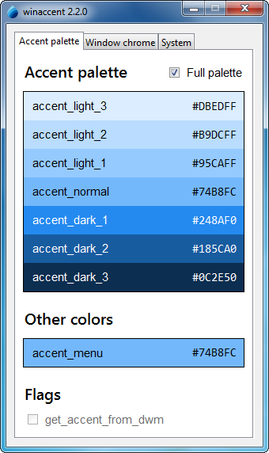

# Try the demo

Before using winaccent, you can try the demo program to see how it works and what features are implemented. The demo program can be launched in 3 different modes: console mode, GUI mode and auto mode.

!!! warning
    You must have winaccent installed to be able to run the demo program. See [Installation](installation.md) for more information about installing winaccent.


## The console mode
In the console mode, the demo program will display the current winaccent version and everything winaccent can get. To launch the demo program, type the following command in your terminal:

<div class="md-typeset">
<pre><code><span style="color: var(--terminal-yellow)">python</span> <span style="color: var(--terminal-blue)">-m</span> winaccent <span style="color: var(--terminal-blue)">--mode</span> console</code></pre>
</div>

The output will look like this:

<style>
    .console-demo {
        height: 300px !important;
    }
</style>

<div class="md-typeset">
<pre>
<code class="console-demo">winaccent 2.2.0
===============

<span style="color: var(--terminal-yellow)">Accent palette<br>--------------</span>

accent_light_3:               <span style="color: #99EBFF;">██</span> #99EBFF
accent_light_2:               <span style="color: #4CC2FF;">██</span> #4CC2FF
accent_light_1:               <span style="color: #0091F8;">██</span> #0091F8
accent_normal:                <span style="color: #0078D4;">██</span> #0078D4
accent_dark_1:                <span style="color: #0067C0;">██</span> #0067C0
accent_dark_2:                <span style="color: #003E92;">██</span> #003E92
accent_dark_3:                <span style="color: #001A68;">██</span> #001A68

accent_menu:                  <span style="color: #0078D4;">██</span> #0078D4


<span style="color: var(--terminal-yellow)">Window chrome<br>-------------</span>

is_titlebar_colored:          <span style="color: var(--terminal-red)">False</span>
titlebar_active:              <span style="color: #F3F3F3;">██</span> #F3F3F3
titlebar_active_text:         <span style="color: #000000;">██</span> #000000
titlebar_inactive:            <span style="color: #F3F3F3;">██</span> #F3F3F3
titlebar_inactive_text:       <span style="color: #929292;">██</span> #929292
window_border_active:         <span style="color: #757575;">██</span> #757575
window_border_inactive:       <span style="color: #757575;">██</span> #757575


<span style="color: var(--terminal-yellow)">Start Menu<br>----------</span>

is_start_menu_colored:        <span style="color: var(--terminal-red)">False</span>
start_menu:                   <span style="color: #242424;">██</span> #242424


<span style="color: var(--terminal-yellow)">Taskbar<br>-------</span>

is_taskbar_colored:           <span style="color: var(--terminal-red)">False</span>
taskbar:                      <span style="color: #1C1C1C;">██</span> #1C1C1C


<span style="color: var(--terminal-yellow)">UI Appearance<br>-------------</span>

transparency_effects_enabled: <span style="color: var(--terminal-green)">True</span>
apps_use_light_theme:         <span style="color: var(--terminal-red)">False</span>
system_uses_light_theme:      <span style="color: var(--terminal-red)">False</span>
</code>
</pre>
</div>


## The GUI mode
In the GUI mode, the demo program will display a window with an interactive user interface where you can better explore what winaccent has to offer. To run the demo program in the GUI mode, run the following command:

<div class="md-typeset">
<pre><code><span style="color: var(--terminal-yellow)">python</span> <span style="color: var(--terminal-blue)">-m</span> winaccent <span style="color: var(--terminal-blue)">--mode</span> gui</code></pre>
</div>

<br>
The GUI demo looks like this:

<style>
    figure {
        flex-shrink: 0;
        margin: 0px !important;
    }

    .screenshot {
        height: 574px !important;
        width: 340px !important;
        object-fit: scale-down !important;
        object-position: top !important;
    }
</style>

<div markdown align="center" style="display: flex; flex-wrap: no-wrap; overflow-x: auto; margin-bottom: 64px !important; scrollbar-width: thin; gap: 32px;">

<figure markdown>
{ .screenshot }
<br><p>Windows Vista</p>
</figure>

<figure markdown>
{ .screenshot }
<br><p>Windows 7</p>
</figure>

<figure markdown>
{ .screenshot }
<br><p>Windows 8.x</p>
</figure>

<figure markdown>
{ .screenshot }
<br><p>Windows 10 (light mode)</p>
</figure>

<figure markdown>
{ .screenshot }
<br><p>Windows 10 (dark mode)</p>
</figure>

<figure markdown>
{ .screenshot }
<br><p>Windows 11 (light mode)</p>
</figure>

<figure markdown>
{ .screenshot }
<br><p>Windows 11 (dark mode)</p>
</figure>

</div>

!!! warning
    The GUI mode will not work if Python isn't installed with tcl/tk support, because the GUI demo program is written in tkinter. If you installed Python on your computer without tcl/tk support, follow these steps to modify your installation to include the support:

    **Windows 11**:

    1. Open the Settings app.
    2. In the sidebar, click on "Apps".
    3. In the Apps section, go to "Installed apps"
    4. Using the search box, look for "Python" and find your Python installation (not the Launcher).
    5. Click the 3 dots next to your Python installation and choose "Modify".
    6. If the User Account Control window appears, click on "Yes".
    7. After the Python Setup window appeared, choose "Modify".
    8. In the Optional features section, make sure "tcl/tk and IDLE" option is checked and then click "Next".

    **Windows 10**:

    1. Open the Settings app.
    2. From the list of settings categories, choose "Apps"
    3. Using the search box, look for "Python" and find your Python installation (not the Launcher).
    4. Click on your Python installation, then choose "Modify".
    5. If the User Account Control window appears, click on "Yes".
    6. After the Python Setup window appeared, choose "Modify"
    7. In the Optional features section, make sure "tcl/tk and IDLE" option is checked and then click "Next".

    **Windows 8.x, 7, Vista:**

    1. Open Control Panel.
    2. Using the search box, look for "Programs and features" and when found click on it.
    3. In the list of the programs displayed, look for your Python installation (not the Launcher), right-click on it and then choose "Change".
    4. If the User Account Control window appears, click on "Yes"
    5. After the Python Setup window appeared, choose "Modify"
    6. In the Optional features section, make sure "tcl/tk and IDLE" option is checked and then click "Next".

    After installation of tcl/tk, the GUI demo program should be working.


## The auto mode
The auto mode will basically run the demo program in GUI mode if tcl/tk is available, installed correctly and no other error occurs or in console mode if tcl/tk is unavailable, not installed correctly or an error occured. To run the demo program in the auto mode, run the following command:

<div class="md-typeset">
<pre><code><span style="color: var(--terminal-yellow)">python</span> <span style="color: var(--terminal-blue)">-m</span> winaccent <span style="color: var(--terminal-blue)">--mode</span> auto</code></pre>
</div>

... or even shorter:

<div class="md-typeset">
<pre><code><span style="color: var(--terminal-yellow)">python</span> <span style="color: var(--terminal-blue)">-m</span> winaccent</code></pre>
</div>

## Shorter command

For an easier way to run the demo program, you can try the `winaccent` command. It also supports the `--mode` argument that we've discussed previously.

Some examples for running the command:

<div class="md-typeset">
<pre><code><span style="color: var(--terminal-yellow)">winaccent</span></code></pre>
</div>

<div class="md-typeset">
<pre><code><span style="color: var(--terminal-yellow)">winaccent</span> <span style="color: var(--terminal-blue)">--mode</span> auto</code></pre>
</div>

<div class="md-typeset">
<pre><code><span style="color: var(--terminal-yellow)">winaccent</span> <span style="color: var(--terminal-blue)">--mode</span> gui</code></pre>
</div>

<div class="md-typeset">
<pre><code><span style="color: var(--terminal-yellow)">winaccent</span> <span style="color: var(--terminal-blue)">--mode</span> console</code></pre>
</div>

<br>

!!! note
    The shorter `winaccent` command was added in version 2.2.0. It isn't available in older versions.

!!! warning
    If the command doesn't work and you're using a supported winaccent version, make sure your Python installation's `Scripts` folder is included in your `PATH` environment variable. To do that, follow these steps:
    
    &emsp;1. Open the Start menu, type "Edit the system environment variables", and then click on the first option.
    <br>

    &emsp;2. Click on "Environment Variables.

    &emsp; 
    
    <br>

    &emsp;3. Under "User variables for USERNAME", find the "Path" variable and double-click on it.
    
    &emsp; 
    
    <br>

    &emsp;4. Look for the following path here:

    ```
    C:\Users\%user_folder%\AppData\Roaming\Python\Python%version%\Scripts
    ```

    &emsp;where:

    &emsp;`%user_folder%` is the name of your user folder (type `echo %username%` in the Command Prompt to get it)

    &emsp;`%version%` is the Python's version, without any dot (`.`) and patch version. For example, if you have Python 3.11.9 installed, `%version%` will be 311. 
    
    <br>

    &emsp;If you can't find it, click on the "New" button, type the path shown above (replace %user_folder% and %version% with your own values, without `%`), then press Enter, and then click "OK". If you can see it, then you can skip this step.
    
    <br>

    &emsp;5. Under "System variables", look for the "Path" variable and double-click on it.
    
    &emsp; 

    <br>

    &emsp;6. Look for the following path here:

    ```
    C:\Program Files\Python%version%\Scripts
    ```

    &emsp;where `%version%` is the Python's version, without any dot (`.`) and patch version (for example, if you have Python 3.11.9 installed, `%version%` will be 311),

    &emsp;If you can't find it, click on the "New" button, type the path shown above (replace %version% with your own value, without `%`), then press Enter, and then click "OK" If you can see it, then you can skip this step.
    
    <br>

    &emsp;7. Click "OK" to close the "Environment Variables" window.
    <br>

    &emsp;8. Click "OK" to close the "System Properties" window.