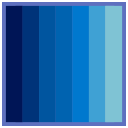

# What's winaccent

[{ .ghbadge }](https://pypi.org/project/winaccent/)
[{ .ghbadge }]()
[{ .ghbadge }]()
[{ .ghbadge }](https://pypi.org/project/winaccent/)
[{ .ghbadge }](https://pypi.org/project/winaccent/)
[{ .ghbadge }](https://github.com/Valer100/winaccent/stargazers)
[{ .ghbadge }](https://github.com/Valer100/winaccent/graphs/contributors)
[{ .ghbadge }](https://github.com/Valer100/winaccent/commits/main)
[{ .ghbadge }](https://github.com/Valer100/winaccent/commits/main)
[{ .ghbadge }](https://github.com/Valer100/winaccent/blob/main/LICENSE)

[{ .ghbadge }](https://pypi.org/project/winaccent/)
[{ .ghbadge }]()
[{ .ghbadge }]()
[{ .ghbadge }](https://pypi.org/project/winaccent/)
[{ .ghbadge }](https://pypi.org/project/winaccent/)
[{ .ghbadge }](https://github.com/Valer100/winaccent/stargazers)
[{ .ghbadge }](https://github.com/Valer100/winaccent/graphs/contributors)
[{ .ghbadge }](https://github.com/Valer100/winaccent/commits/main)
[{ .ghbadge }](https://github.com/Valer100/winaccent/commits/main)
[{ .ghbadge }](https://github.com/Valer100/winaccent/blob/main/LICENSE)

    

    
winaccent is a simple and lightweight Python module for easily retrieving Windows' accent color, including its shades, specific window chrome colors such as active/inactive title bar and window borders and settings like theme (both apps' and system's theme), transparency effects, and more. Supports Windows Vista, 7, 8.x, 10 and 11 and doesn't require additional dependencies.

[:material-book:&nbsp;&nbsp;Get started](about/requirements.md){ .button }