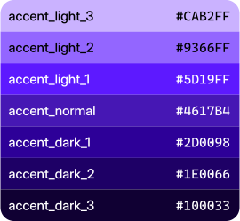

# Flags
<!-- Added in <font color="#4051B5">:material-tag: **v2.1.0**</font> -->

Flags are winaccent settings that customize its behavior. These flags can be used to enable features and modify the output of some variables. All flags belong to the `Flags` class. By default, every flag defaults to `False`. 

!!! important
    After enabling or disabling a flag, make sure to always call `update_values()` for the changes to take effect.

Currently, there are only 2 flags available:

## `GET_ACCENT_FROM_DWM` flag
When set to `True`, this flag is responsible for changing the `accent_normal` color to the active title bar color (the colorized one on Windows 10 and 11 and the color with maximum intensity on Windows 8.x; `ColorizationColor` in Windows 8.x and `AccentColor` in Windows 10 and 11 in the registry) and generate the accent palette accordingly. This flag makes more sense for Windows 8.x systems, because on Windows 10 and 11 the colored title bar color is usually the same as the system's accent color, but it can also be enabled on Windows 10 and 11. You can enable it like this:

```python
import winaccent

# Before enabling the flag
print("Before enabling the flag")
print("========================\n")
print(f"accent_light_3: {winaccent.accent_light_3}")
print(f"accent_light_2: {winaccent.accent_light_2}")
print(f"accent_light_1: {winaccent.accent_light_1}")
print(f"accent_normal: {winaccent.accent_normal}")
print(f"accent_dark_1: {winaccent.accent_dark_1}")
print(f"accent_dark_2: {winaccent.accent_dark_2}")
print(f"accent_dark_3: {winaccent.accent_dark_3}")

# Enable the flag
winaccent.Flags.GET_ACCENT_FROM_DWM = True
winaccent.update_values()  # Required for the flag changes to take effect

# After enabling the flag
print("After enabling the flag")
print("=======================\n")
print(f"accent_light_3: {winaccent.accent_light_3}")
print(f"accent_light_2: {winaccent.accent_light_2}")
print(f"accent_light_1: {winaccent.accent_light_1}")
print(f"accent_normal: {winaccent.accent_normal}")
print(f"accent_dark_1: {winaccent.accent_dark_1}")
print(f"accent_dark_2: {winaccent.accent_dark_2}")
print(f"accent_dark_3: {winaccent.accent_dark_3}")
```

<br>

Here's a visual comparasion before enabling the flag and after enabling the flag on Windows 8.x (Normal accent color: <font color="#4617D4">&nbsp;:fontawesome-solid-circle:</font> **#4617D4**; DWM accent color: <font color="#F6C34A">&nbsp;:fontawesome-solid-circle:</font> **#F6C34A**):

<br>
<div markdown align="center">

<br><br>Windows 8.1 example window (title bar color: <font color="#F0C869">&nbsp;:fontawesome-solid-circle:</font> **#F0C869**)
</div>

<div markdown align="center" style="display: flex; flex-wrap: wrap;">

<figure markdown>

<br>Normal accent color palette
</figure>

<figure markdown>

<br>DWM accent color palette
</figure>

</div>


## `DARK_MODE_WINDOW` flag

When set to `True`, this flag will make winaccent return the dark mode versions of the window chrome colors. Useful when your app has also has a dark theme and you want to use the dark mode values when the dark theme is applied. You can enable it like this:

```python
import winaccent

# Before enabling the flag
print("Before enabling the flag")
print("========================\n")
print(f"titlebar_active: {winaccent.titlebar_active}")
print(f"titlebar_inactive: {winaccent.titlebar_inactive}")
print(f"titlebar_active_text: {winaccent.titlebar_active_text}")
print(f"titlebar_inactive_text: {winaccent.titlebar_inactive_text}")
print(f"window_border_active: {winaccent.window_border_active}")
print(f"window_border_inactive: {winaccent.window_border_inactive}")

# Enable the flag
winaccent.Flags.DARK_MODE_WINDOW = True
winaccent.update_values()  # Required for the flag changes to take effect

# After enabling the flag
print("After enabling the flag")
print("=======================\n")
print(f"titlebar_active: {winaccent.titlebar_active}")
print(f"titlebar_inactive: {winaccent.titlebar_inactive}")
print(f"titlebar_active_text: {winaccent.titlebar_active_text}")
print(f"titlebar_inactive_text: {winaccent.titlebar_inactive_text}")
print(f"window_border_active: {winaccent.window_border_active}")
print(f"window_border_inactive: {winaccent.window_border_inactive}")
```

Here's an example output with the flag enabled and disabled on Windows 11:

<div markdown align="center" style="display: flex; flex-wrap: wrap;">

<figure markdown>

<br>Window light mode palette
</figure>

<figure markdown>

<br>Window dark mode palette
</figure>

</div>

!!! warning
    This flag has no effect on Windows 8.x.